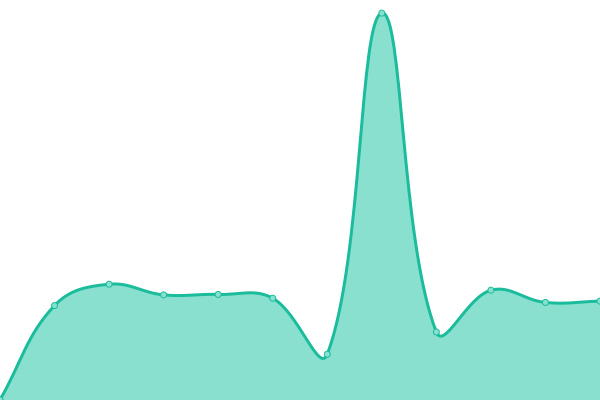

# [📈 Live Status](https://zite-io.github.io/server-status): <!--live status--> **🟩 All systems operational**

This repository contains the open-source uptime monitor and status page for [Zite](https://zite-io.github.io/server-status), powered by [Upptime](https://github.com/upptime/upptime).

<!--start: status pages-->
<!-- This summary is generated by Upptime (https://github.com/upptime/upptime) -->
<!-- Do not edit this manually, your changes will be overwritten -->
<!-- prettier-ignore -->
| URL | Status | History | Response Time | Uptime |
| --- | ------ | ------- | ------------- | ------ |
|  [F-Zite](https://app.zite.io) | 🟩 Up | [f-zite.yml](https://github.com/zite-io/server-status/commits/HEAD/history/f-zite.yml) | 

 578ms
     
 | 

<a href="https://zite-io.github.io/server-status/history/f-zite">100.00%</a>
    

|  [B-Zite](https://app.zite.io/api/v2/sectors) | 🟩 Up | [b-zite.yml](https://github.com/zite-io/server-status/commits/HEAD/history/b-zite.yml) | 

 500ms
     
 | 

<a href="https://zite-io.github.io/server-status/history/b-zite">100.00%</a>
    

|  [F-Common Feedback Platform](https://commonfeedbackplatform.org) | 🟩 Up | [f-common-feedback-platform.yml](https://github.com/zite-io/server-status/commits/HEAD/history/f-common-feedback-platform.yml) | 

 1194ms
     
 | 

<a href="https://zite-io.github.io/server-status/history/f-common-feedback-platform">100.00%</a>
    

|  [B-Common Feedback Platform](https://commonfeedbackplatform.org/api/v2/sectors) | 🟩 Up | [b-common-feedback-platform.yml](https://github.com/zite-io/server-status/commits/HEAD/history/b-common-feedback-platform.yml) | 

 310ms
     
 | 

<a href="https://zite-io.github.io/server-status/history/b-common-feedback-platform">100.00%</a>
    

|  [F-Zite Manager](https://app.zitemanager.org/) | 🟩 Up | [f-zite-manager.yml](https://github.com/zite-io/server-status/commits/HEAD/history/f-zite-manager.yml) | 

 667ms
     
 | 

<a href="https://zite-io.github.io/server-status/history/f-zite-manager">100.00%</a>
    

|  [B-Zite Manager](https://app.zitemanager.org/api/v2/sectors) | 🟩 Up | [b-zite-manager.yml](https://github.com/zite-io/server-status/commits/HEAD/history/b-zite-manager.yml) | 

 226ms
     
 | 

<a href="https://zite-io.github.io/server-status/history/b-zite-manager">100.00%</a>
    

<!--end: status pages-->

[**Visit our status website →**](https://zite-io.github.io/server-status)

## 📄 License

- Powered by: [Upptime](https://github.com/upptime/upptime)
- Code: [MIT](./LICENSE) © [Keith Bradner](https://Zite.github.io/upptime)
- Data in the `./history` directory: [Open Database License](https://opendatacommons.org/licenses/odbl/1-0/)
